# Graph

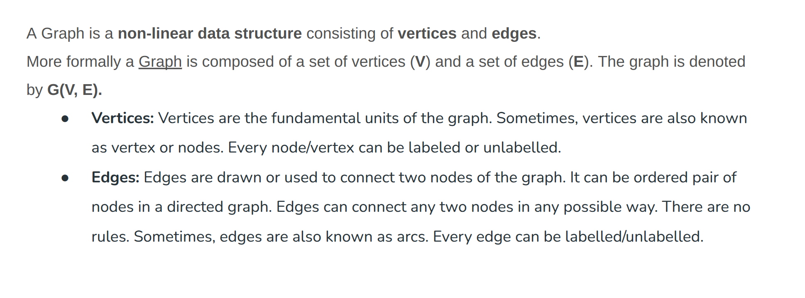

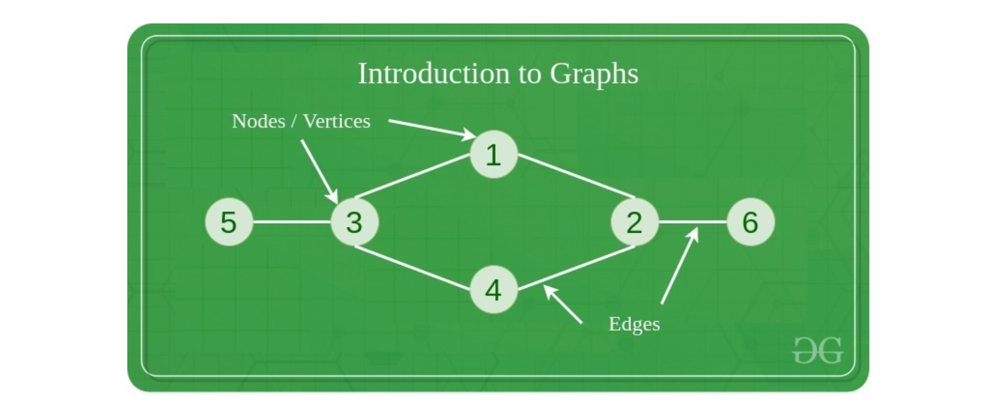

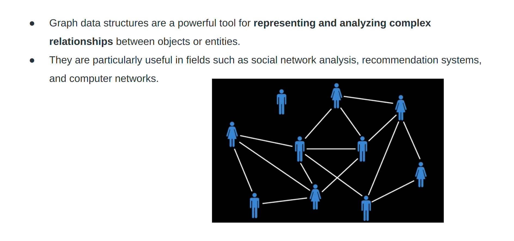

## Type of Graph

### Undirected

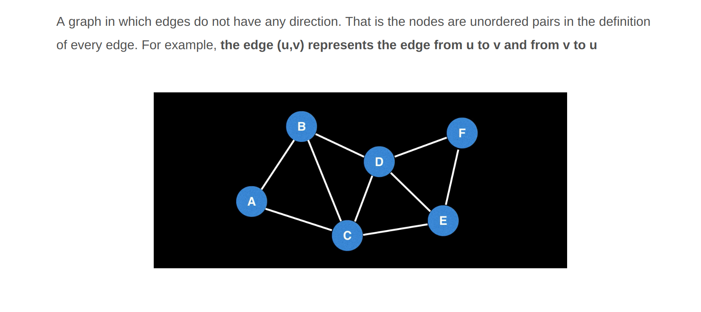

### Directed

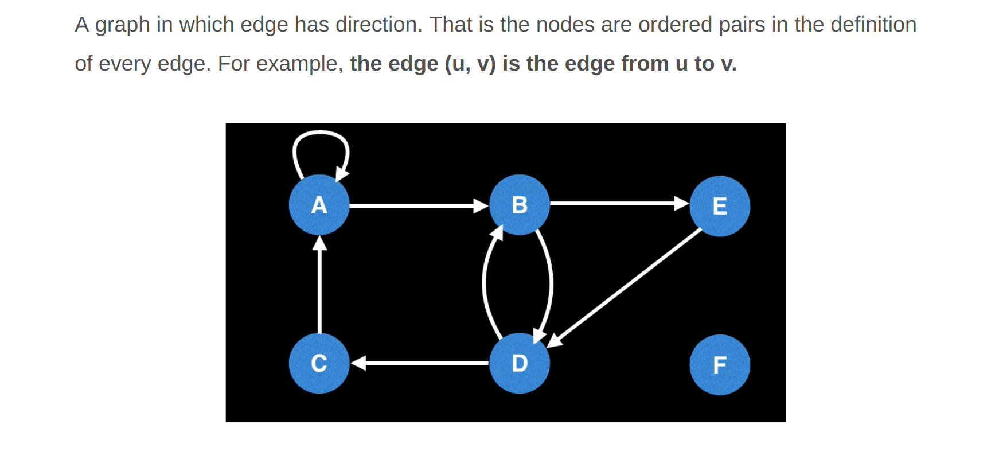

### Weighted

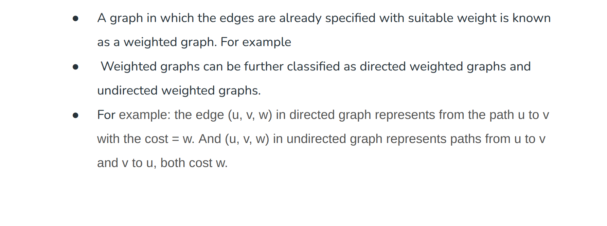

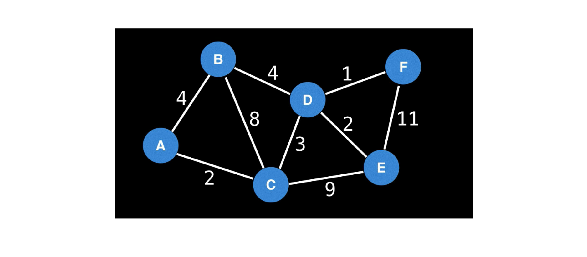

### Connected

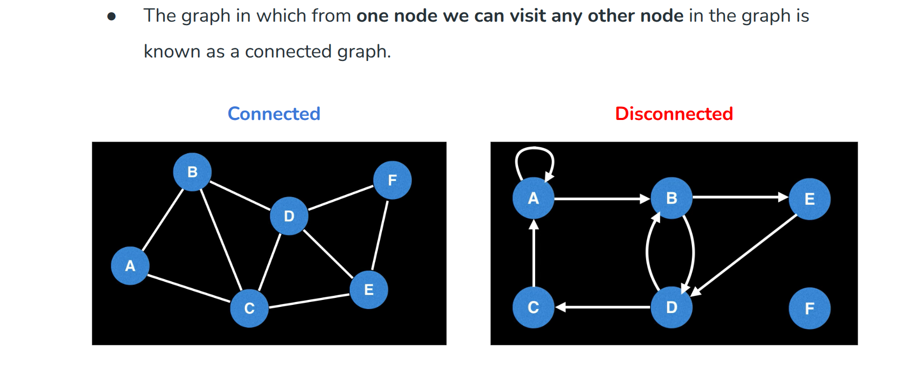

### Graph with cycle - cyclic graph

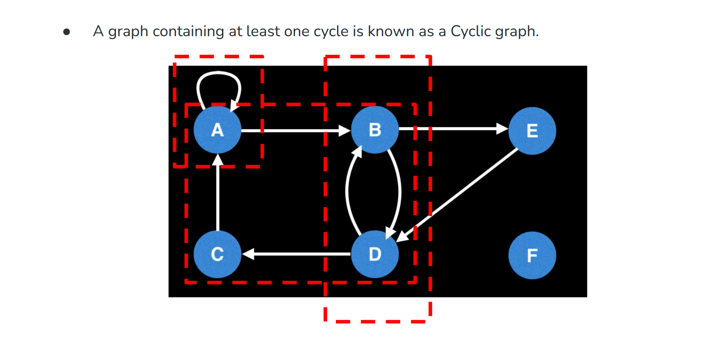

### Tree

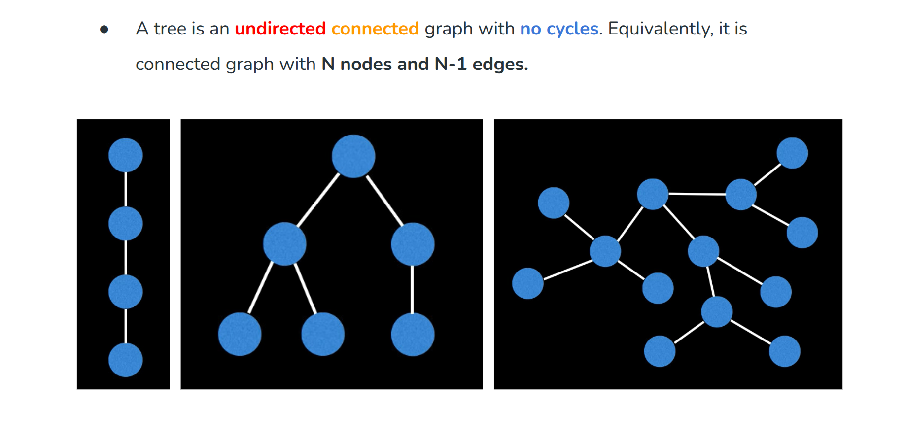

### DAG/Directed acyclic graph

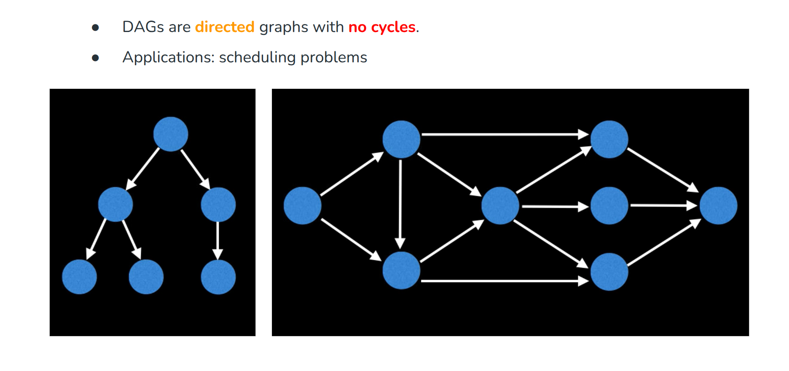

## Graph representations

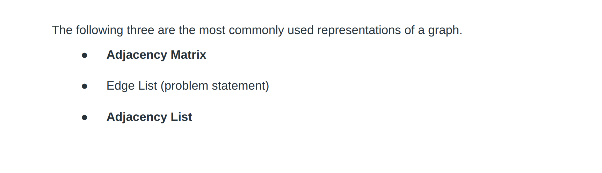

### Adjacency Matrix

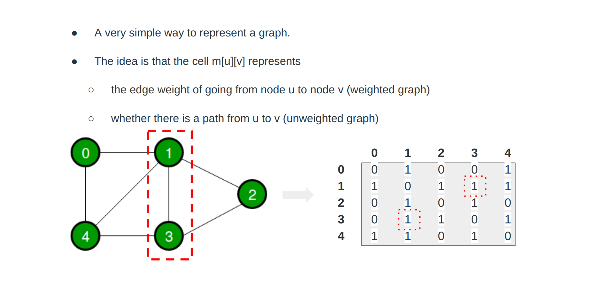

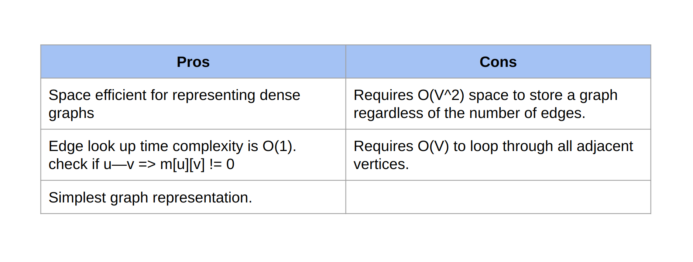

### Edge list

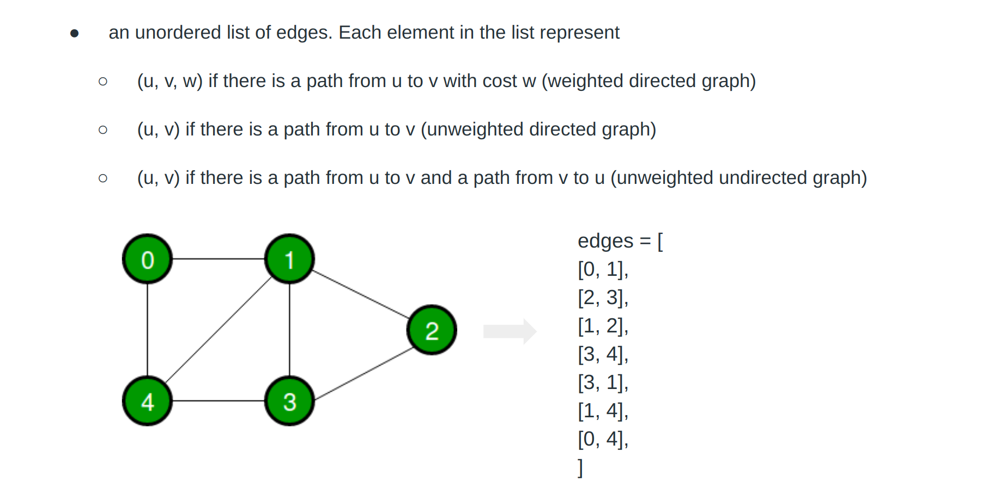

### Adjacency list

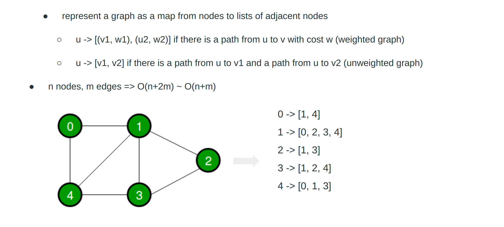

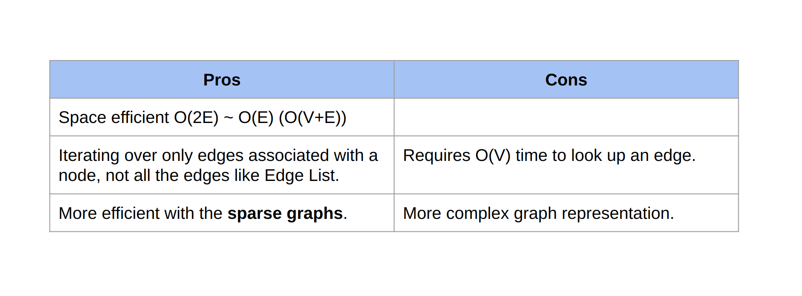

### Tree

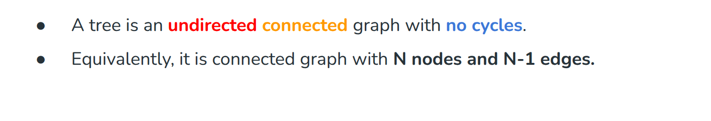

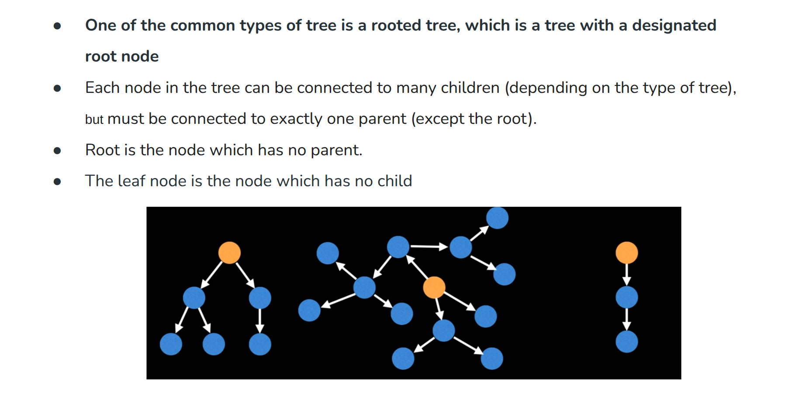

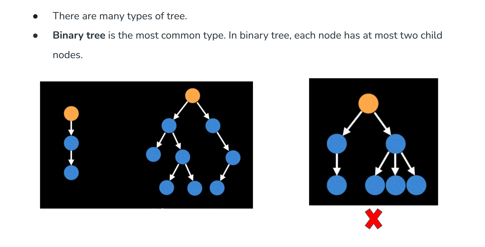

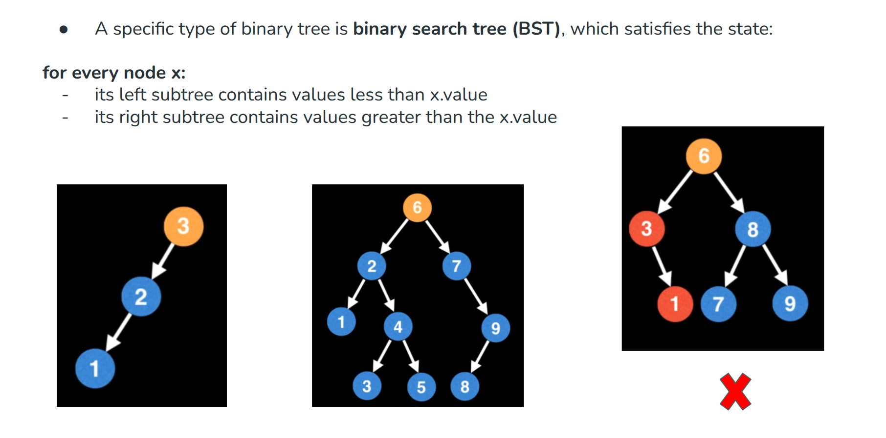
