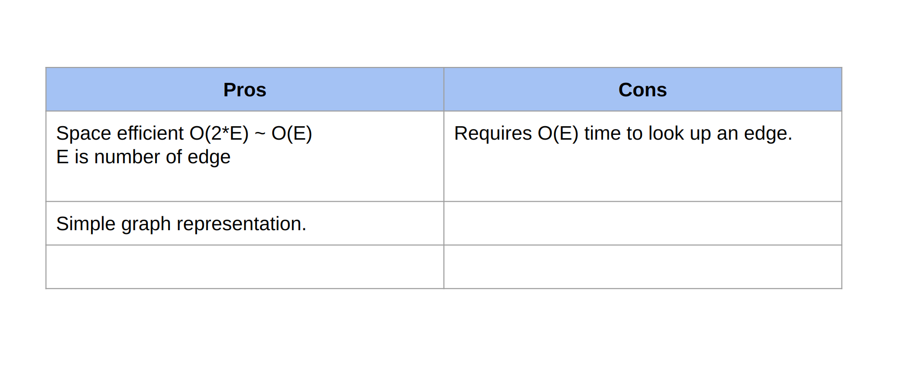

# Graph

## Type of Graph

### Undirected

### Directed

### Weighted

### Connected

### Graph with cycle - cyclic graph

### Tree

### DAG/Directed acyclic graph

## Graph representations

### Adjacency Matrix

### Edge list

### Adjacency list

### Tree

