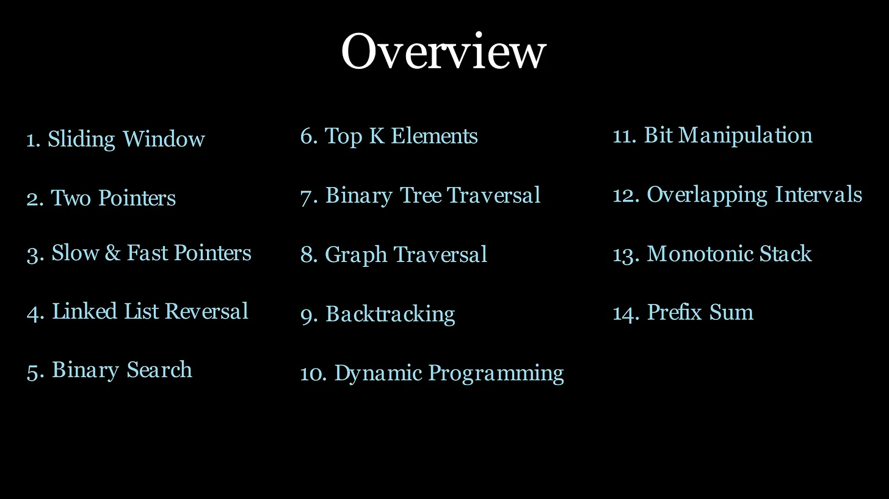
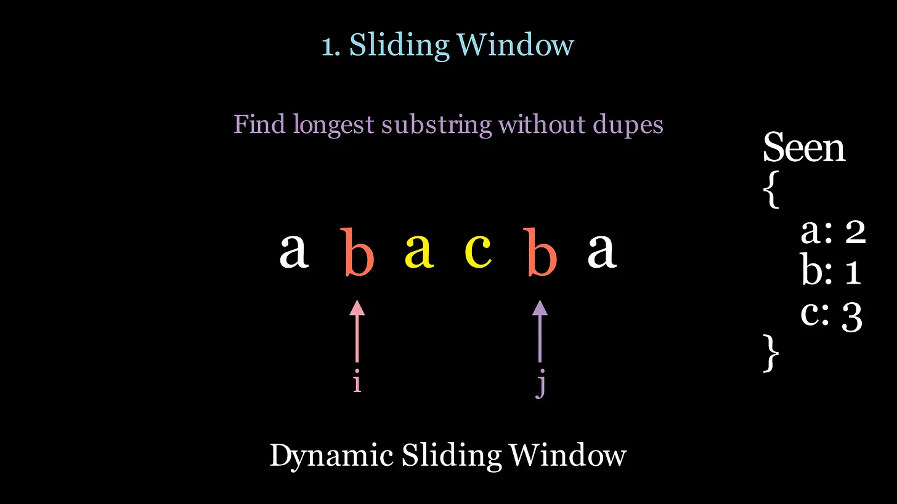
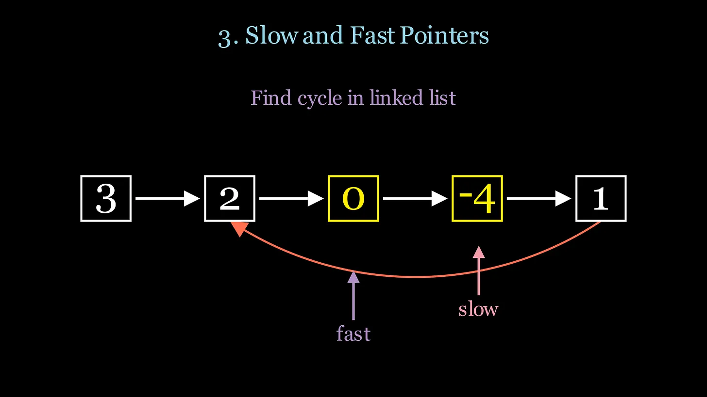
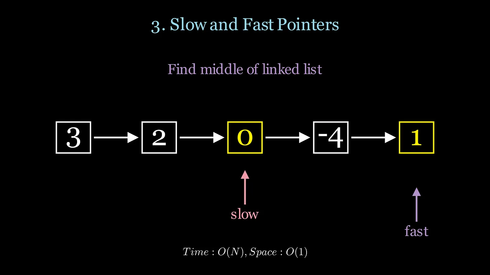
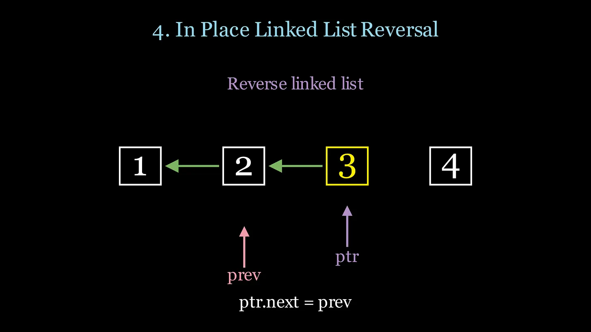
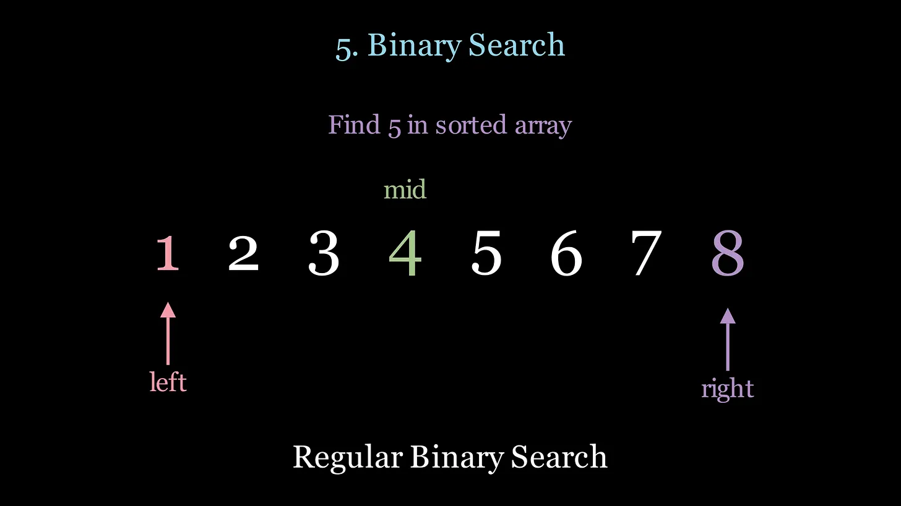
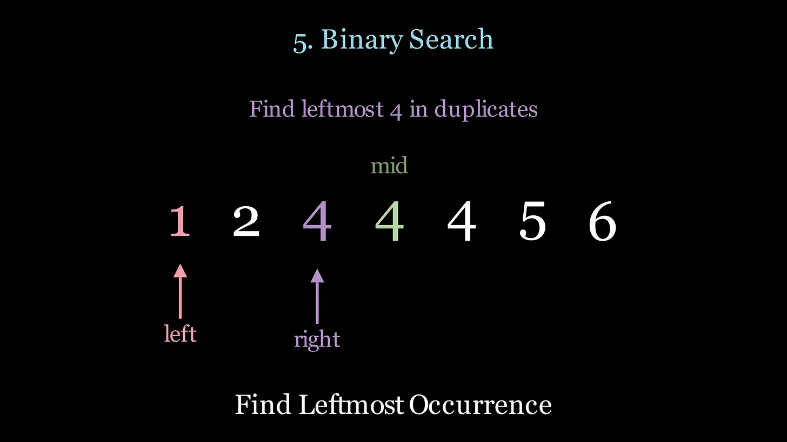
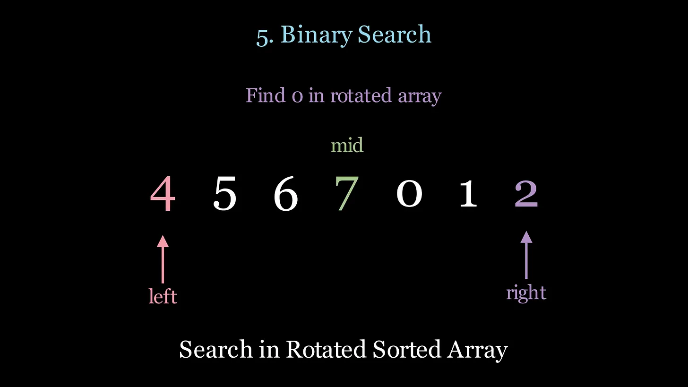
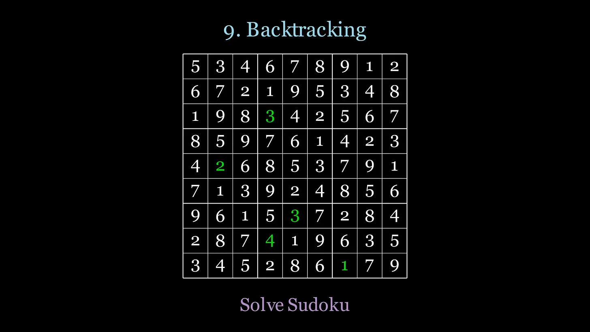
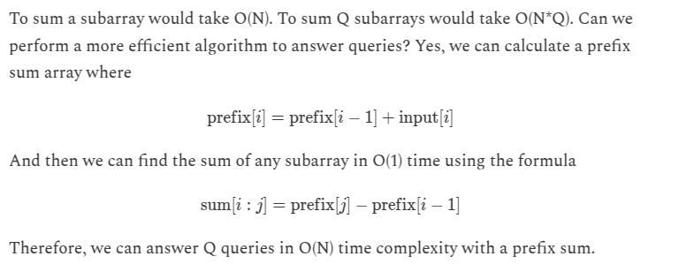

```
*Introduction:*
  - 8 important patterns for coding interviews split into two categories:
    - *Linear structures:* arrays, linked lists, strings.
    - *Nonlinear structures:* trees, graphs.
  - Focus on pre-built code templates for these patterns.

- *Linear Data Structure Patterns:*
  1. *Two Pointers:*
     - Reduces time complexity to linear time \(O(n)\).
     - Two methods:
       - Same direction: used for scanning data in a single pass (e.g., fast and slow pointers to detect cycles or find middle elements).
       - Opposite directions: used for finding pairs (e.g., sum of two numbers in a sorted array).
  2. *Sliding Window:*
     - Refines two pointers to manage a window of elements dynamically.
     - Expands or contracts the window to meet specific conditions (e.g., longest substring without repeating characters).
     - Often combined with hashmaps.
  3. *Binary Search:*
     - Efficiently finds target in logarithmic time \(O(\log n)\).
     - Extends to lists with monotonic conditions, not just sorted numbers.
     - Example: finding the minimum in a rotated sorted array.

- *Nonlinear Data Structure Patterns:*
  4. *Breadth-First Search (BFS):*
     - Explores nodes level by level.
     - Uses a queue to keep track of visited nodes (ideal for level order traversal).
     - Dives deep into one path before exploring others.
     - Often uses recursion and is memory efficient for exploring all paths.
     - Example: counting islands in a grid.
  6. *Backtracking:*
     - Extension of DFS, explores all possible solutions.
     - Builds the solution dynamically by making decisions and backtracking on invalid paths.
     - Example: letter combinations of a phone number.

- *Heaps (Priority Queue):*
  7. *Heaps:*
     - Used for questions related to top K, K smallest/largest.
     - *Min Heap:* smallest value at the root.
     - *Max Heap:* largest value at the root.
     - Max Heap is used to find K smallest values, and vice versa for K largest.

- *Dynamic Programming (DP):*
  8. *Dynamic Programming:*
     - Optimizes solutions by breaking problems into overlapping subproblems.
     - Two approaches:
       - *Top-down:* recursive with memoization to store results.
       - *Bottom-up:* solves smaller subproblems iteratively using a table.
```

# Detail



# 1.Sliding Window


### When to use it?

- Linear data structures (arrays, lists, strings)

- Must scan through a subarray or substring

- When the subarray must satisfy some condition (shortest/longest/min/max)

- Improve time complexity from O(N^2) to O(N)

### Technique

In the sliding window, you have 2 pointers, i and j. Move j as far as you can until your condition is no longer valid, then move the i pointer closer to j until the condition is valid again to shrink the window. At every iteration, keep track of the min/max length of the subarray for the result. Without the sliding window technique, we would need to use a double for loop resulting in O(N^2) time. The sliding window is O(N) time complexity.

## Dynamic Sliding Window



<br>

In the dynamic sliding window, the size of the window (subarray between i and j) changes throughout the algorithm. In this example, we scan the subarray “bacb” and find that we have a duplicate “b”, so we will move the i pointer to shrink the window and move on to letter “a”, resulting in “acb”, then we start moving j again.

<br>

## Fixed Sliding Window


In the fixed sliding window, the size of the window is the same length throughout the algorithm. In this case, we need scan subarrays of length 3 for the final result, so we initialize i and j to indices 0 and 2 and at every iteration we increment i and j by 1.
<br>

## Coding Templates

```
"""
A generic template for dynamic sliding window finding min window length
"""
def shortest_window(nums, condition):
    i = 0
    min_length = float('inf')
    result = None

    for j in range(len(nums)):
        # Expand the window
        # Add nums[j] to the current window logic

        # Shrink window as long as the condition is met
        while condition():
            # Update the result if the current window is smaller
            if j - i + 1 < min_length:
                min_length = j - i + 1
                # Add business logic to update result

            # Shrink the window from the left
            # Remove nums[i] from the current window logic
            i += 1

    return result

"""
A generic template for dynamic sliding window finding max window length
"""
def longest_window(nums, condition):
    i = 0
    max_length = 0
    result = None

    for j in range(len(nums)):
        # Expand the window
        # Add nums[j] to the current window logic

        # Shrink the window if the condition is violated
        while not condition():
            # Shrink the window from the left
            # Remove nums[i] from the current window logic
            i += 1

        # Update the result if the current window is larger
        if j - i + 1 > max_length:
            max_length = j - i + 1
            # Add business logic to update result

    return result

"""
A generic template for sliding window of fixed size
"""
def window_fixed_size(nums, k):
    i = 0
    result = None

    for j in range(len(nums)):
        # Expand the window
        # Add nums[j] to the current window logic

        # Ensure window has size of K
        if (j - i + 1) < k:
            continue

        # Update Result
        # Remove nums[i] from window
        # increment i to maintain fixed window size of length k
        i += 1

    return result
```

## LeetCode Questions

- [longest-substring-without-repeating-characters](https://leetcode.com/problems/longest-substring-without-repeating-characters/description/)
- [longest-repeating-character-replacement](https://leetcode.com/problems/longest-repeating-character-replacement/description/)
- [substrings-of-size-three-with-distinct-characters](https://leetcode.com/problems/substrings-of-size-three-with-distinct-characters/description/)
- [minimum-window-substring](https://leetcode.com/problems/minimum-window-substring/description/)

# 2. Two Pointers


## When to use it?

- Linear data structures (arrays, lists, strings)

- When you need to scan the start and end of a list

- When you have a sorted list and need to find pairs

- Removing duplicates or filtering

## Technique

Instead of scanning all possible subarrays or substrings, use two pointers i and j at the ends of a string or sorted array to be clever how you increment i or decrement j as you scan the input. This will lower your time complexity from O(N^2) to O(N). In the example above, to detect if a string is a palindrome we scan the ends of the string one character at a time. If the characters are equal, move i and j closer together. If they are not equal, the string is not a palindrome.

## Coding Templates

```
def two_pointer_template(input):
    # Initialize pointers
    i = 0
    j = len(input) - 1
    result = None

    # Iterate while pointers do not cross
    while i < j:
        # Process the elements at both pointers

        # Adjust the pointers based on specific conditions
        # i += 1 or j -= 1

        # Break or continue based on a condition if required

    # Return the final result or process output
    return result
```

## LeetCode Questions

- [valid-palindrome](https://leetcode.com/problems/valid-palindrome/description/)
- [3sum](https://leetcode.com/problems/3sum/description/)
- [container-with-most-water](https://leetcode.com/problems/container-with-most-water/description/)

# 3.Slow and Fast Pointers



## Slow and Fast Pointers

- Linear data structures (arrays, lists, strings)

- Detect cycle in linked list

- Find middle of linked list

- Perform in one pass with O(1) space

## Technique

Use two pointers, a slow and fast pointer. Slow moves once and fast moves twice at every iteration. Instead of using a data structure to store previous nodes to detect a cycle which requires O(N) space, using the two pointer technique will find a cycle with O(1) space if fast loops around the cycle and will eventually meet slow. You can also use this technique to find the middle of a linked list in O(1) space and 1 pass.



## Coding Templates

```
def slow_fast_pointers(head):
    # Initialize pointers
    slow = head
    fast = head
    result = None

    # move slow once, move fast twice
    while fast and fast.next:
        slow = slow.next
        fast = fast.next.next

        # update result based on custom logic
        # Example: if fast == slow then cycle is detected

    return result
```

## LeetCode Questions

- [linked-list-cycle](https://leetcode.com/problems/linked-list-cycle/description/)
- [linked-list-cycle-iilinked-list-cycle-ii](https://leetcode.com/problems/linked-list-cycle-ii/description/)
- [remove-nth-node-from-end-of-list](https://leetcode.com/problems/remove-nth-node-from-end-of-list/description/)

# 4. In Place Linked List Reversal



- Reverse a linked list in 1 pass and O(1) space

- Reverse a specific portion of a linked list

- Reverse nodes in groups of k

## TechniqueTechnique

Use two pointers, prev and ptr which point to the previous and current nodes. To reverse a linked list, ptr.next = prev. Then, move prev to ptr and move ptr to the next node. At the end of the algorithm, prev will point to the head of the reversed list.

## Coding Templates

```
def reverse_linked_list(head):
    prev = None
    ptr = head
    while ptr:
        # Save the next node
        next_node = ptr.next

        # Reverse the current node's pointer
        ptr.next = prev

        # Move the pointers one step forward
        prev = ptr
        ptr = next_node

    # prev is the new head after the loop ends
    return prev
```

## LeetCode Questions

- [reverse-linked-list](https://leetcode.com/problems/reverse-linked-list/description/)
- [reorder-list](https://leetcode.com/problems/reorder-list/description/)
- [reverse-nodes-in-k-group](https://leetcode.com/problems/reverse-nodes-in-k-group/description/)

# 5. Binary Search



## When to use it?

- Input is sorted and you need to find a number

- Finding the position of insertion in a sorted list

- Handling duplicates in sorted arrays

- Searching in rotated sorted arrays

## Technique

Start left and right pointers at indices 0 and n-1, then find the mid point and see if that is equal to, less than, or greater than your target. If nums[mid] > target, go left by moving the right pointer to mid-1. If nums[mid] < target, go right by moving left to mid+1. Binary Search reduces search time complexity from O(N) to O(NLogN)

## Modified Binary Search



You may be required to find the leftmost or rightmost target value in an array containing duplicates. <br>



You may be required to find a target in a rotated sorted array. <br>

## Coding Templates

```
"""
Classic binary search algorithm that finds a target value
"""
def classic_binary_search(array, target):
    left, right = 0, len(array)-1
    while left <= right:
        mid = left + (right - left) // 2
        if array[mid] == target:
            return mid
        elif array[mid] < target:
            left = mid + 1
        else:
            right = mid - 1
    return -1

"""
A generic template for binary search such that the returned value
is the minimum index where condition(k) is true

Example 1:
array = [1,2,2,2,3]
target = 2
binary_search(array, lambda mid: array[mid] >= target) --> 1

Example 2:
array = [1,2,2,2,3]
target = 2
binary_search(array, lambda mid: array[mid] > target) --> 4
"""
def binary_search(array, condition):
    left, right = 0, len(array)
    while left < right:
        mid = left + (right - left) // 2
        if condition(mid):
            right = mid
        else:
            left = mid + 1
    return left

"""
Binary search algorithm that can search a rotated array
by selected the appropriate half to scan at each iteration
"""
def binary_search_rotated_array(array, target):
    left, right = 0, len(array)-1

    while left <= right:
        mid = (left + right) // 2
        if array[mid] == target:
            return mid

        # left side sorted
        if array[left] <= array[mid]:
            # if target is contained in left sorted side, go left
            if array[left] <= target <= array[mid]:
                right = mid - 1
            else:
                left = mid + 1

        # right side sorted
        else:
            # if target is contained in right sorted side, go right
            if array[mid] <= target <= array[right]:
                left = mid + 1
            else:
                right = mid - 1

    return -1
```

## LeetCode Questions

- [find-first-and-last-position-of-element-in-sorted-array](https://leetcode.com/problems/find-first-and-last-position-of-element-in-sorted-array/description/)

- [find-minimum-in-rotated-sorted-array](https://leetcode.com/problems/find-minimum-in-rotated-sorted-array/description/)

- [search-in-rotated-sorted-array](https://leetcode.com/problems/search-in-rotated-sorted-array/description/)

# 6. Top K Elements


## When to use it?

- Find the top k smallest or largest elements

- Find the kth smallest or largest element

- Find the k most frequent elements

## Technique

You can always sort an array and then take the first or last k elements, however the time complexity would be O(NLogN). A heap can pop and push elements in O(Log(K)) where K is the size of the heap. Therefore, instead of sorting, we can use a heap to hold the smallest or largest K values, and for every element in the array check whether to pop/push to the heap, resulting in a time complexity of O(NLogK).

## Coding Templates

```
"""
A generic template for the Top K Smallest elements.
"""
import heapq
def top_k_smallest_elements(arr, k):
    if k <= 0 or not arr:
        return []

    # Use a max heap to maintain the k smallest elements
    max_heap = []

    for num in arr:
        # Python does not have a maxHeap, only min Heap
        # Therefore, negate the num to simulate a max heap
        heapq.heappush(max_heap, -num)
        if len(max_heap) > k:
            heapq.heappop(max_heap)

    # Convert back to positive values and return
    return [-x for x in max_heap]

"""
A generic template for the Top K Largest elements.
"""
import heapq
def top_k_largest_elements(arr, k):
    if k <= 0 or not arr:
        return []

    # Use a min heap to maintain the k largest elements
    min_heap = []

    for num in arr:
        heapq.heappush(min_heap, num)
        if len(min_heap) > k:
            heapq.heappop(min_heap)

    return min_heap
```

## LeetCode Questions

- [kth-largest-element-in-an-array](https://leetcode.com/problems/kth-largest-element-in-an-array/description/)

- [top-k-frequent-elements](https://leetcode.com/problems/top-k-frequent-elements/description/)

- [merge-k-sorted-lists](https://leetcode.com/problems/merge-k-sorted-lists/description/)

# 7. Binary Tree Traversal


<br>


## When to use it?

- Preorder: Serialize or deserialize a tree

- Inorder: Retrieve elements in sorted order (BSTs)

- Postorder: Process children before parent (bottom-up)

- BFS: Level by level scanning

## Technique

For the preorder, inorder, and postorder traversals use recursion (DFS). For the level by level scan use BFS iteratively with a queue.

## Coding Templates

```
"""
Preorder traversal: visit node, then left subtree, then right subtree.
"""
def preorder_traversal(node):
    if not node:
        return
    # visit node
    preorder_traversal(node.left)
    preorder_traversal(node.right)

"""
Inorder traversal: visit left subtree, then node, then right subtree.
"""
def inorder_traversal(node):
    if not node:
        return
    inorder_traversal(node.left)
    # visit node
    inorder_traversal(node.right)

"""
Postorder traversal: visit left subtree, then right subtree, then node
"""
def postorder_traversal(node):
    if not node:
        return
    postorder_traversal(node.left)
    postorder_traversal(node.right)
    # visit node

"""
BFS traversal: Visit all nodes level by level using a queue
"""
from collections import deque
def bfs_traversal(root):
    queue = deque([root])
    while queue:
        node = queue.popleft()
        if node:
            # visit node
            queue.append(node.left)
            queue.append(node.right)
```

## LeetCode Questions

-[maximum-depth-of-binary-tree](https://leetcode.com/problems/maximum-depth-of-binary-tree/description/)

- [binary-tree-level-order-traversal](https://leetcode.com/problems/binary-tree-level-order-traversal/description/)

- [construct-binary-tree-from-preorder-and-inorder-traversal](https://leetcode.com/problems/construct-binary-tree-from-preorder-and-inorder-traversal/description/)

- [binary-tree-maximum-path-sum](https://leetcode.com/problems/binary-tree-maximum-path-sum/description/)

# Graph and Matrices


<br>


<br>


<br>


## When to use it?

- Search graphs or matrices

- DFS: Explore all possible paths (e.g., maze)

- BFS: Find the shortest path

- Topological Sort: Order tasks based on dependencies

## Technique

DFS (Depth-First Search) traverses as deep as possible along each branch before backtracking, prioritizing visiting nodes or cells in a recursive or stack-based manner. BFS (Breadth-First Search) explores all neighbors of a node or cell before moving deeper, traversing level by level using a queue. For DFS use recursion with a visited set to keep track of visited nodes. For BFS use iteration with a queue and a visited set to keep track of visited nodes. In a graph, neighbors are found in the adjacency list. In a matrix, neighbors are up/down/left/right cells, with some examples including diagonals

## Coding Templates

```
"""
DFS for a graph represented as an adjacency list
"""
def dfs(graph):
    visited = set()
    result = []

    def explore(node):
        visited.add(node)
        result.append(node)  # process node
        for neighbor in graph[node]:
            if node not in visited:
                explore(neighbor)

    def dfs_driver(graph):
        for node in graph:
            if node not in visited:
                explore(node)

    dfs_driver()
    return result

"""
BFS for a graph represented as an adjacency list
"""
from collections import deque
def bfs(graph, start):
    visited = set()
    result = []

    queue = deque([start])
    while queue:
        node = queue.popleft()
        if node not in visited:
            visited.add(node)
            result.append(node)  # process node
            for neighbor in graph[node]:
                queue.append(neighbor)

    return result

"""
Topological Sort only works on DAG graphs with no cycles
"""
def topological_sort(graph):
    visited = set()
    topo_order = []

    def hasCycle(node, curpath):
        visited.add(node)
        curpath.add(node)

        for neighbor in graph[node]:
            if neighbor in curpath: # cycle detected, no topo sort
                return True
            if neighbor in visited:
                continue
            if hasCycle(neighbor, curpath):
                return True

        curpath.remove(node)
        topo_order.append(node) # process node
        return False

    for node in graph:
        if node not in visited:
            if hasCycle(node, set()):
                return None # cycle detected, no topo sort

    # reverse to get the correct topological order
    return topo_order[::-1]

"""
DFS for a matrix, visiting all connected cells.
"""
def dfs_matrix(matrix):
    m, n = len(matrix), len(matrix[0])
    visited = set()
    result = []

    def explore(i, j):
        if not (0 <= i < m and 0 <= j < n):
            return
        if ((i,j)) in visited:
            return
        visited.add((i,j))
        result.append(matrix[i][j])  # process the cell

        # Explore neighbors (up, down, left, right)
        for deltaI, deltaJ in [(-1, 0), (1, 0), (0, -1), (0, 1)]:
            explore(i + deltaI, j + deltaJ)

    def dfs_driver():
        for i in range(m):
            for j in range(n):
                if (i, j) not in visited:
                    explore(i, j)

    dfs_driver()
    return result

"""
BFS for a matrix, visiting all connected cells.
"""
from collections import deque
def bfs_matrix(matrix, startI, startJ):
    m, n = len(matrix), len(matrix[0])
    visited = set()
    result = []

    queue = deque([(startI,startJ)])
    while queue:
        i, j = queue.popleft()
        if not (0 <= i < m and 0 <= j < n):
            continue
        if ((i,j)) in visited:
            continue
        visited.add((i,j))
        result.append(matrix[i][j])  # process the cell

        # Enqueue neighbors (up, down, left, right)
        for deltaI, deltaJ in [(-1, 0), (1, 0), (0, -1), (0, 1)]:
            queue.append((i + deltaI, j + deltaJ))

    return result
```

## LeetCode Questions

- [word-search](https://leetcode.com/problems/word-search/description/)
- [course-schedule](https://leetcode.com/problems/course-schedule/description/)
- [rotting-oranges](https://leetcode.com/problems/rotting-oranges/description/)
- [pacific-atlantic-water-flow](https://leetcode.com/problems/pacific-atlantic-water-flow/description/)
- [word-ladder](https://leetcode.com/problems/word-ladder/description/)

# 9. Backtracking



<br>


## When to use it?

- Combinatorial problems (combinations, permutations, subsets)

- Constraint satisfaction (Sudoku, N-Queens)

- Prune paths using constraints to reduce search space

## Technique

Backtracking is closely related to DFS, but with a focus on finding solutions while validating their correctness. If a solution doesn't work, you backtrack by returning to the previous recursive state and trying a different option. Additionally, backtracking uses constraints to eliminate branches that cannot lead to a valid solution, making the search more efficient.

## Coding Templates

```
"""
Generic backtracking template.
"""
def backtrack(candidates, curPath):
    # Base case: Check if the solution meets the problem's criteria
    if is_solution(curPath):
        process_solution(curPath)
        return

    for candidate in candidates:
        if is_valid(candidate, curPath):
            # Take the current candidate
            curPath.append(candidate)

            # Recurse to explore further solutions
            backtrack(candidates, curPath)

            # Undo the choice (backtrack)
            curPath.pop()
```

## LeetCode Questions

- [subsets](https://leetcode.com/problems/subsets/description/)
- [permutations](https://leetcode.com/problems/permutations/description/)
- [combination-sum](https://leetcode.com/problems/combination-sum/description/)
- [sudoku-solver](https://leetcode.com/problems/sudoku-solver/description/)
- [n-queens](https://leetcode.com/problems/n-queens/description/)

# 10. Dynamic Programming


<br>


<br>


## When to use it?

- Overlapping subproblems and optimal substructure

- Optimization problems (min/max distance, profit, etc.)

- Sequence problems (longest increasing subsequence)

- Combinatorial problems (number of ways to do something)

- Reduce time complexity from exponential to polynomial

## Technique

`Dynamic Programming` is used when you need to solve a problem that depends on previous results from subproblems. You can effectively “cache” these previous result values when you calculate them for the first time to be re-used later. Dynamic Programming has 2 main techniques: <br>

    - `Top Down - Recursion (DFS) with Memoization`. Memoization is a fancy word for a hashmap that can cache the values previously calculated. In the top down approach you start with the global problem and the recursively split it into subproblems to then solve the global problem.
    - `Bottom Up` - Iteratively performed by using an array/matrix to store previous values. In the bottom up approach we start with base cases and then build up to the global solution iteratively.
    - Many times bottom up is preferred since you can reduce the space complexity if you don’t need access to all subproblems and can store the last couple of subproblem results using variables.

<br>

```
"""
Top-down recursive Fibonacci without memoization.
Time: O(2^N) | Space: O(N)
"""
def fib_top_down(n):
    if n == 0:
        return 0
    if n == 1:
        return 1
    return fib_top_down(n-1) + fib_top_down(n-2)

"""
Top-down recursive Fibonacci with memoization.
Time: O(N) | Space: O(N)
"""
def fib_top_down_memo(n, memo={}):
    if n in memo:
        return memo[n]
    if n == 0:
        return 0
    if n == 1:
        return 1
    memo[n] = fib_top_down_memo(n-1, memo) + fib_top_down_memo(n-2, memo)
    return memo[n]

"""
Bottom-up Fibonacci using an array.
Time: O(N) | Space: O(N)
"""
def fib_bottom_up_array(n):
    dp = [0] * (n + 1)
    dp[1] = 1

    for i in range(2, n + 1):
        dp[i] = dp[i - 1] + dp[i - 2]

    return dp[n]

"""
Bottom-up Fibonacci using 2 variables.
Time: O(N) | Space: O(1)
"""
def fib_bottom_up(n):
    prev2, prev1 = 0, 1

    for i in range(2, n + 1):
        fib = prev2 + prev1
        prev2 = prev1
        prev1 = fib

    return prev1
```

## LeetCode Questions

- [climbing-stairs](https://leetcode.com/problems/climbing-stairs/description/)
- [coin-change](https://leetcode.com/problems/coin-change/description/)
- [longest-common-subsequence](https://leetcode.com/problems/longest-common-subsequence/description/)
- [longest-increasing-subsequence](https://leetcode.com/problems/longest-increasing-subsequence/description/)
- [edit-distance](https://leetcode.com/problems/edit-distance/description/)

# 11. Bit Manipulation


## When to use it?

- Count number of 0 or 1 bits in a number

- Add numbers without using addition or substraction

- Find a missing number in a list

## Technique

For bit manipulation, ensure you understand the basic bitwise operators: AND, OR, NOT, XOR and bitwise shifts. Specifically, XOR has interesting properties that allow you to find a missing number in a list or add up 2 numbers without using the addition or subtraction operation. You want to be comfortable with some of the basic bitwise operators, but don’t go too in depth here as these questions can be quite rare.

## Coding Templates

```
"""
Useful bitwise operators for LeetCode
"""
def binary_operators():
    return {
        "AND": a & b,
        "OR": a | b,
        "XOR": a ^ b,
        "NOT": ~a, # ~a = -a-1 in python
        "Left Shift (a << b)": a << b,  # left shift 'a' by 'b' bits
        "Right Shift (a >> b)": a >> b,  # right shift 'a' by 'b' bits
        "Mask": a & 1 # gives you the least significant bit of a
    }
```

## LeetCode Questions

- [number-of-1-bits](https://leetcode.com/problems/number-of-1-bits/description/)
- [reverse-bits](https://leetcode.com/problems/reverse-bits/description/)
- [missing-number](https://leetcode.com/problems/missing-number/description/)
- [sum-of-two-integers](https://leetcode.com/problems/sum-of-two-integers/description/)
- [counting-bits](https://leetcode.com/problems/counting-bits/description/)

# 12. Overlapping Intervals


<br>


## When to use it?

- Merge or consolidate ranges

- Schedule or find conflicts (e.g. meeting rooms)

- Find gaps or missing intervals

## Technique

Knowing how to merge overlapping intervals is crucial for these problems. <br>


<br>

Usually, you will want to sort the input by the start times so you can guarantee order and always have “a” appear before “b”, making it easier to compare time ranges in chronological order. In the example above, we insert [4,8] into the array, but that eventually gets merged with [3,5], [6,7], and [8,10], into [3,10].

## Coding Templates

```
"""
Generic template for interval problems
"""
def process_intervals(intervals):
    # Sort intervals by start time (common preprocessing step)
    intervals.sort(key=lambda x: x[0])

    # Example: Merged intervals (modify as needed for your problem)
    result = []
    for interval in intervals:
        # If result is empty or no overlap with the last interval in result
        if not result or result[-1][1] < interval[0]:
            result.append(interval)  # Add the interval as is
        else:
            # Merge overlapping intervals
            result[-1][1] = max(result[-1][1], interval[1])

    return result
```

## LeetCode Questions

- [insert-interval](https://leetcode.com/problems/insert-interval/description/)
- [merge-intervals](https://leetcode.com/problems/merge-intervals/description/)
- [non-overlapping-intervals](https://leetcode.com/problems/non-overlapping-intervals/description/)
- [single-threaded-cpu](https://leetcode.com/problems/single-threaded-cpu/description/)

# 13. Monotonic Stack


<br>


## When to use it?

- Find Next Greater or Smaller Element

- Find left/right boundary points in histograms or rectangles

- Maintain elements in order to optimize operations

## Technique

If you want to find the next greater/smaller element for all elements in an array the brute force approach will take O(N^2). However, with the use of a monotonic stack (either increasing or decreasing order, depending on the problem), we can achieve O(N) time by storing and keeping track of the greatest/smallest elements up until the current iteration. In the example above, notice that we popped 57 from the stack because 69 is greater than 57. However, 76 is greater than 69 so it is a valid solution and we update the output.

## Coding Templates

```
"""
Monotonic increasing stack template.
"""
def monotonic_increasing_stack(arr):
    stack = []
    for i, num in enumerate(arr):
        # Modify condition based on the problem
        while stack and stack[-1][0] > num:
            stack.pop()

        if stack:
            pass # process result from top of stack

        # Append current value and index
        stack.append((num,i))

"""
Monotonic decreasing stack template.
"""
def monotonic_decreasing_stack(arr):
    stack = []
    for i, num in enumerate(arr):
        # Modify condition based on the problem
        while stack and stack[-1][0] < num:
            stack.pop()

        if stack:
            pass # process result from top of stack

        # Append current value and index
        stack.append((num,i))
```

## LeetCode Questions

- [next-greater-element-i](https://leetcode.com/problems/next-greater-element-i/description/)
- [next-greater-element-ii](https://leetcode.com/problems/next-greater-element-ii/description/)
- [daily-temperatures](https://leetcode.com/problems/daily-temperatures/description/)
- [largest-rectangle-in-histogram](https://leetcode.com/problems/largest-rectangle-in-histogram/description/)

## 14. Prefix Sum


## When to use it?

- Cumulative sums are needed from index 0 to any element

- Querying subarray sums frequently across multiple ranges

- Partial sums can be reused efficiently

## Technique



## Coding Templates

```
"""
Builds the prefix sum array
"""
def build_prefix_sum(arr):
    # Initialize prefix sum array
    n = len(arr)
    prefix = [0] * n

    # First element is the same as the original array
    prefix[0] = arr[0]

    # Build the prefix sum array
    for i in range(1, n):
        prefix[i] = prefix[i - 1] + arr[i]

    return prefix

"""
Queries the sum of elements in a subarray [left, right] using prefix sum.
"""
def query_subarray_sum(prefix, i, j):
    if i == 0:
        return prefix[j]
    return prefix[j] - prefix[i - 1]
```

## LeetCode Questions

- [range-sum-query-immutable](https://leetcode.com/problems/range-sum-query-immutable/description/)
- [continuous-subarray-sum](https://leetcode.com/problems/continuous-subarray-sum/description/)
- [subarray-sum-equals-k](https://leetcode.com/problems/subarray-sum-equals-k/description/)
