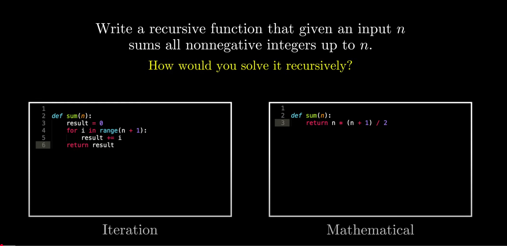
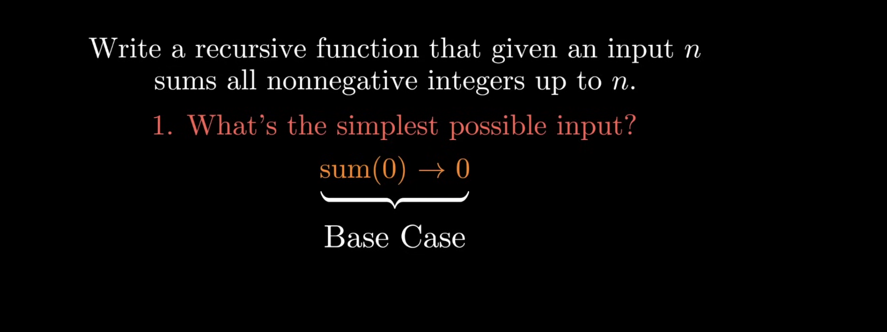
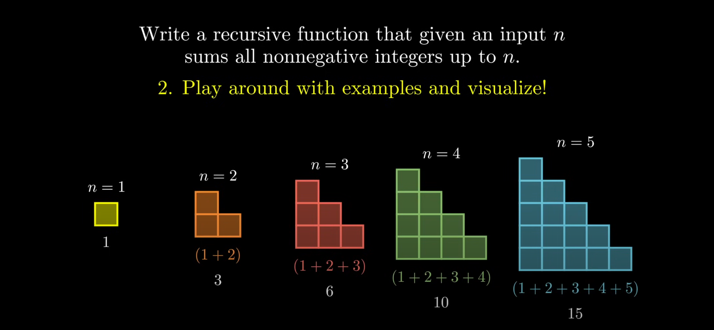
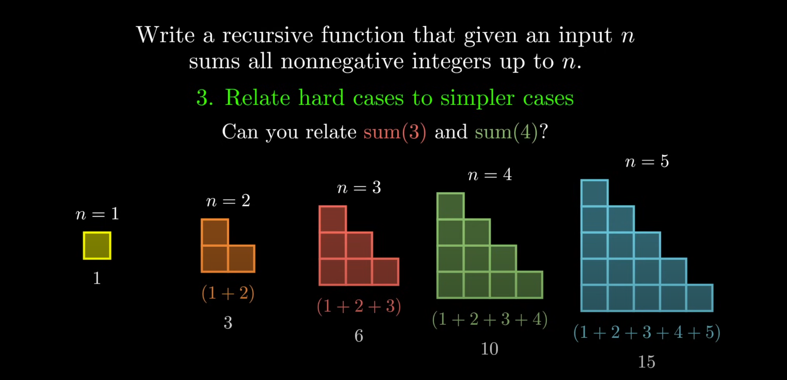
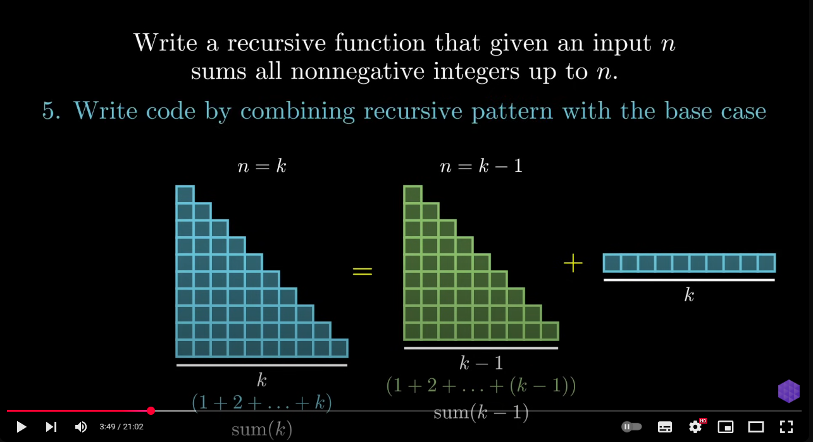

# Pattern

## 1> What is the simplest possible input ? (Base case - Stop condition)

## 2> Play around with example and visualize

## 3> Relate hard case to simple case

## > Generalize pattern

## 5> Write code

## Link

[5 step to solve recursion](https://www.youtube.com/watch?v=ngCos392W4w)
